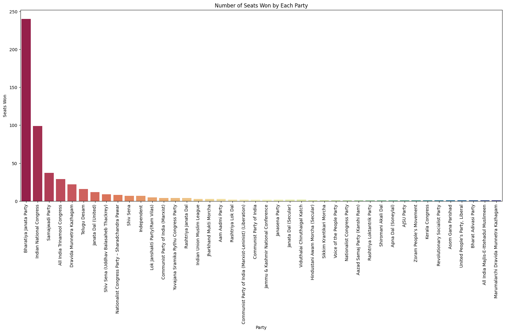
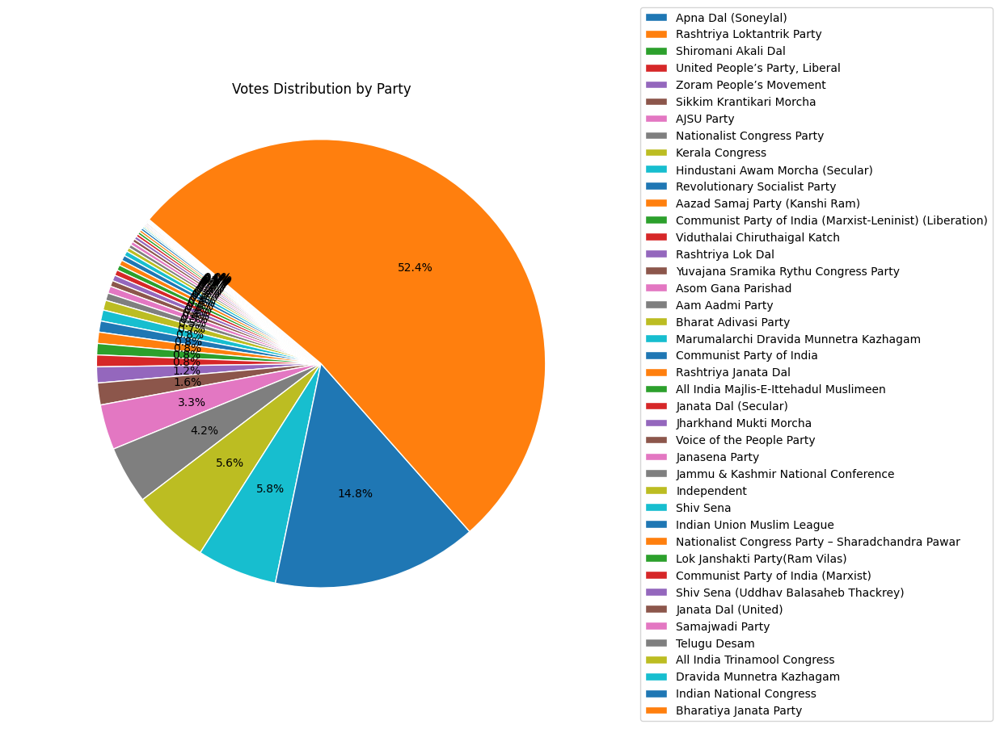
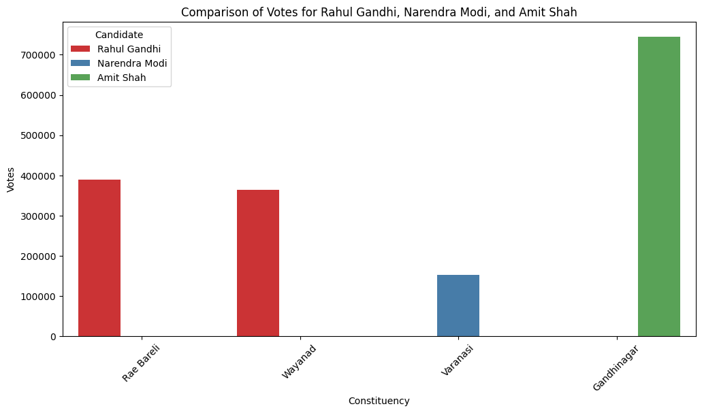
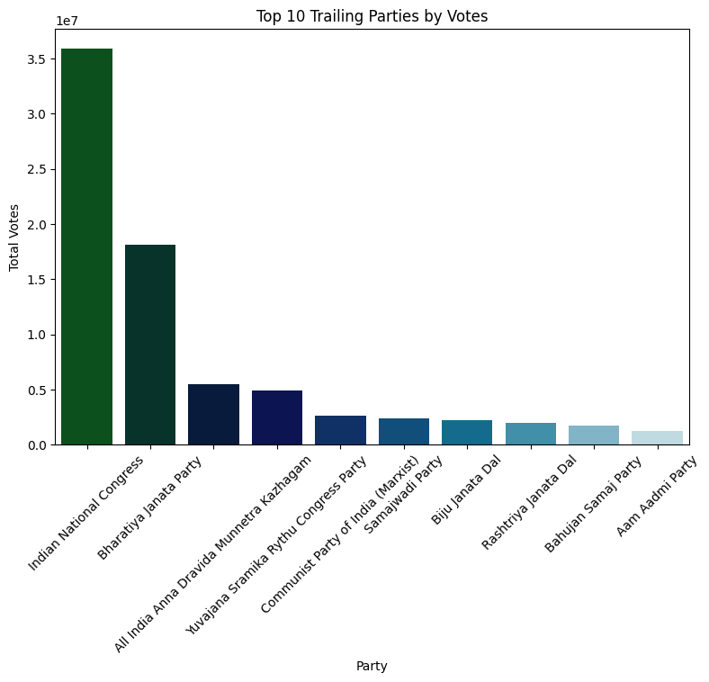

<div align="center">


<br/><br/>

[](https://www.python.org/)
[](https://pandas.pydata.org/)
[](https://numpy.org/)
[](https://matplotlib.org/)
[](https://seaborn.pydata.org/)

&nbsp;&nbsp;&nbsp;

</div>

<br/>

<br/>

A constituency-level data analysis of the 2024 Indian General Election, covering all 543 Lok Sabha seats. The project examines party performance, victory margins, candidate competitiveness, and regional voting patterns using Python's standard data science stack.

---

## Table of Contents

- [Overview](#overview)
- [Objectives](#objectives)
- [Dataset](#dataset)
- [Party Directory — 18th Lok Sabha](#party-directory--18th-lok-sabha)
- [Methodology](#methodology)
- [Analysis & Visualizations](#analysis--visualizations)
  - [Party-Wise Seat Distribution](#party-wise-seat-distribution)
  - [Party Performance](#party-performance)
  - [Candidate Vote Share Comparison](#candidate-vote-share-comparison)
  - [Margin of Victory](#margin-of-victory)
  - [Top Winning Margins](#top-winning-margins)
  - [Runner-Up (Trailing) Analysis](#runner-up-trailing-analysis)
  - [Regional Performance](#regional-performance)
- [Key Findings](#key-findings)
- [Tech Stack](#tech-stack)
- [Project Structure](#project-structure)
- [Getting Started](#getting-started)
- [Future Scope](#future-scope)
- [Contributing](#contributing)
- [License](#license)

---

## Overview

This project analyzes the results of the 2024 Lok Sabha (Indian General Election) at the constituency level. It transforms raw election data into structured insights on:

- Party-wise seat performance across all 543 constituencies
- Victory margins and electoral competitiveness
- Candidate-level vote share comparisons
- Runner-up performance and near-win contests
- Regional and state-level voting trends

The goal is to provide a clear, data-driven view of constituency outcomes without making predictive or political claims beyond what the dataset supports.

## Objectives

**Electoral Analysis**
- Analyze constituency-wise outcomes
- Evaluate winning party performance and seat share
- Measure victory margins and electoral competitiveness

**Political Intelligence**
- Compare performance across parties
- Identify regional strongholds and closely contested seats
- Examine voting patterns by state/region

**Data Exploration**
- Constituency-level insights and result verification
- Margin distribution analysis
- Candidate-level (winner vs. runner-up) comparisons

## Dataset

| Field | Description |
|---|---|
| `Constituency` | Parliamentary constituency name |
| `Const. No.` | Unique constituency identifier |
| `Leading Candidate` | Winning candidate |
| `Leading Party` | Winning party |
| `Trailing Candidate` | Runner-up candidate |
| `Trailing Party` | Runner-up party |
| `Margin` | Victory margin (votes) |
| `Status` | Result status |

**Snapshot**

| Metric | Value |
|---|---|
| Election Year | 2024 |
| Total Constituencies | 543 |
| Granularity | Constituency-level |
| Coverage | All states and union territories |

> Source the raw data file path/link here, e.g. `data/lok_sabha_2024_results.csv`, and note its provenance (e.g. Election Commission of India) so results are reproducible and verifiable.

---

## Party Directory — 18th Lok Sabha

<div align="center">

</div>

<br/>

<div align="center">


</div>

Party symbols as recognized by the Election Commission of India for the 18th Lok Sabha.

> **Adding logos:** drop each party's official logo image (PNG/SVG, ideally square, ~40×40px) into `images/parties/` using the filename shown in the `Logo file` column below, then it will render automatically in the `Logo` column. Official party symbols/emblems are trademarked by the respective parties and the Election Commission of India — source them from each party's official website or the [ECI's recognized symbols list](https://www.eci.gov.in/) and use in accordance with applicable trademark/usage guidelines. This repo does not ship third-party logo files.

<br/>

<div align="center">

| Index | Party | Party Symbol |
|:---:|:---|:---|
| 1. | Bharatiya Janata Party (BJP) |  |
| 2. | Indian National Congress (INC) |  |
| 3. | Samajwadi Party (SP) |  |
| 4. | All India Trinamool Congress (AITC) |  |
| 5. | Dravida Munnetra Kazhagam (DMK) |  |
| 6. | Telugu Desam Party (TDP) |  |
| 7. | Janata Dal (United) (JD(U)) |  |
| 8. | Shiv Sena (Uddhav Balasaheb Thackeray) (SS(UBT)) | |
| 9. | Shiv Sena (SHS) |  |
|  | Nationalist Congress Party (Sharadchandra Pawar) (NCP(SP)) | `images/parties/ncpsp.png` |
|  | Lok Janshakti Party (Ram Vilas) (LJP(RV)) | `images/parties/ljprv.png` |
|  | YSR Congress Party (YSRCP) | `images/parties/ysrcp.png` |
|  | Rashtriya Janata Dal (RJD) | `images/parties/rjd.png` |
|  | Communist Party of India (Marxist) (CPI(M)) | `images/parties/cpim.png` |
|  | Aam Aadmi Party (AAP) | `images/parties/aap.png` |
|  | Indian Union Muslim League (IUML) | `images/parties/iuml.png` |
|  | Jharkhand Mukti Morcha (JMM) | `images/parties/jmm.png` |
|  | Rashtriya Lok Dal (RLD) | `images/parties/rld.png` |
|  | Janata Dal (Secular) (JD(S)) | `images/parties/jds.png` |
|  | Jana Sena Party (JnP) | `images/parties/jnp.png` |
|  | Viduthalai Chiruthaigal Katchi (VCK) | `images/parties/vck.png` |
|  | Communist Party of India (CPI) | `images/parties/cpi.png` |
|  | Communist Party of India (Marxist–Leninist) Liberation (CPI(ML)L) | `images/parties/cpiml.png` |
|  | Apna Dal (Sonelal) (AD(S)) | `images/parties/ads.png` |
|  | Asom Gana Parishad (AGP) | `images/parties/agp.png` |
|  | All India Majlis-e-Ittehadul Muslimeen (AIMIM) | `images/parties/aimim.png` |
|  | Shiromani Akali Dal (SAD) | `images/parties/sad.png` |
|  | Sikkim Krantikari Morcha (SKM) | `images/parties/skm.png` |
|  | Zoram People's Movement (ZPM) | `images/parties/zpm.png` |
|  | Jammu & Kashmir National Conference (JKNC) | `images/parties/jknc.png` |

</div>

> Party list based on results declared by the Election Commission of India on 4 June 2024 for the 543-seat 18th Lok Sabha; verify against the [ECI's official statistical reports](https://www.eci.gov.in/general-election-to-loksabha-2024-statistical-reports) before publishing.

<br/>

<br/>

## Methodology

1. **Data cleaning** — standardizing constituency and party names, handling missing/null values, validating margin and vote-count fields.
2. **Exploratory analysis** — aggregating seat counts by party, computing margin distributions, and summarizing candidate-level vote shares.
3. **Visualization** — generating charts with Matplotlib/Seaborn to surface seat distribution, margin trends, and regional patterns.
4. **Interpretation** — summarizing observed patterns as descriptive findings, not predictive or normative claims.

## Analysis & Visualizations

### Party-Wise Seat Distribution



Seat counts by party across all 543 constituencies, including national vs. regional party seat share and state-wise concentration.

### Party Performance



Aggregate seat totals, seat-share percentage, and regional presence by party.

### Candidate Vote Share Comparison



Constituency-level vote totals and margins for selected candidates, included here as an illustrative comparison.

> Replace the example candidates with whichever comparison is most relevant to your analysis, or generalize this section to a "Top Candidates by Vote Share" view to keep the README focused on the dataset rather than specific individuals.

### Margin of Victory

| Category | Description |
|---|---|
| Very Close Contest | Narrow victory margin |
| Competitive Contest | Moderate margin |
| Comfortable Win | Strong lead |
| Landslide Victory | Very large margin |

Margin buckets are used to classify constituency competitiveness and identify closely contested seats.

### Top Winning Margins

Highlights the constituencies with the largest victory margins, representing the most dominant individual results in the dataset.

### Runner-Up (Trailing) Analysis



Examines which parties most frequently finished second, and how narrow those defeats were — useful for identifying competitive but unconverted regions.

### Regional Performance

State- and region-wise breakdown of seat distribution and party influence, highlighting how voting patterns vary geographically.

## Key Findings

- A small number of major parties account for the majority of seats won, with regional parties holding significant influence in specific states.
- Victory margins vary widely, ranging from extremely close contests to landslide wins, reflecting differing levels of electoral competitiveness across regions.
- Runner-up performance data shows several parties with strong second-place finishes, indicating competitive presence even without seat conversion.
- Regional and state-level patterns are a significant factor in overall outcomes, alongside national-level party performance.

> Replace these with the specific, numbers-backed findings from your own analysis (e.g. "Party X won N seats with an average margin of Y votes") once the notebook/script has been run on the dataset.

## Tech Stack

| Technology | Purpose |
|---|---|
| Python | Core data processing |
| Pandas | Data manipulation and analysis |
| NumPy | Numerical computation |
| Matplotlib | Visualization |
| Seaborn | Statistical graphics |
| Jupyter Notebook | Analysis environment |

## Project Structure

```
Election-Result-Analysis/
├── data/
│   └── lok_sabha_2024_results.csv
├── notebooks/
│   └── election_analysis.ipynb
├── images/
│   ├── parties/
│   │   ├── bjp.png
│   │   ├── inc.png
│   │   └── ... (one file per party, see Logo file column above)
│   ├── seat.png
│   ├── votes.png
│   ├── compare.png
│   └── tv.png
├── README.md
└── requirements.txt
```

> Adjust this tree to match your actual repository layout.

## Getting Started

```bash
# Clone the repository
git clone https://github.com/geershatisaxena/Election-Result-Analysis.git
cd Election-Result-Analysis

# Install dependencies
pip install -r requirements.txt

# Run the analysis notebook
jupyter notebook notebooks/election_analysis.ipynb
```

## Future Scope

**Advanced Analytics**
- State-wise deep-dive analysis
- Alliance and coalition impact assessment
- Historical election comparison (2014, 2019, 2024)

**Machine Learning**
- Constituency competitiveness scoring
- Swing-seat identification based on historical margins

**Interactive Dashboards**
- Streamlit or Power BI dashboard for exploring results
- Interactive choropleth maps of constituency outcomes

## Contributing

Contributions are welcome. Please open an issue to discuss proposed changes, or submit a pull request with a clear description of the analysis or fix.

## License

This project is licensed under the [MIT License](LICENSE).

---

<div align="center">


<sub>Data-driven exploration of India's 2024 parliamentary election results 🇮🇳</sub>

</div>
